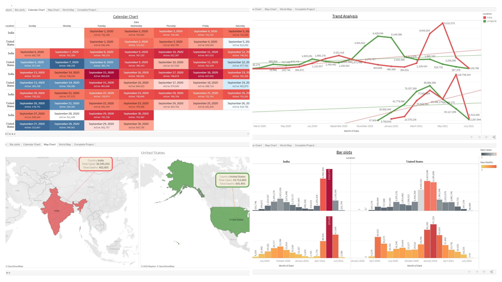

# Introduction

As covid-19 is a buzz word in today's time, so with use of the ML and Visualizing tools we have created a small project on Covid-19. It will help us to understand the covid-19 in better way.  
This DataScience project is in two parts- 
1 Google colab file  
2  Tableau (link below) 
We had taken Covid-19 dataset from https://ourworldindata.org/coronavirus-source-data (Same dataset is in repository, Data upto - 29/June/2021) 
## Colab file
Have done <b>Preprocessing</b> and fetched some countries for visulaization and answering some general questions for covid-19 like- 
Country with Highest and lowest Number of Cases, Deaths, Vaccinations? 
In <b>Second part</b> of colab file have done **Forecasting** of upcoming month(July) and have sumed up the Cases, Deaths, Vaccinations numbers For India and United States. 
## Tableau 
https://public.tableau.com/app/profile/hrithik.nigam/viz/MajorProject_16262618854630/TrendAnalysis 

Above is a sample image of tableau public can visit it via link. 

In Tableau part have done visualization for-
1.   Calender Graph - Active Cases
2.   Map Chart 
3.   Trend Analysis - Cases and Vaccination wrt Date
4.   Bar Graph - Cases vs Deaths 
